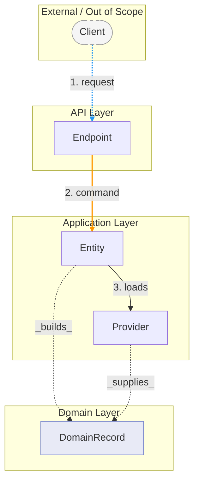
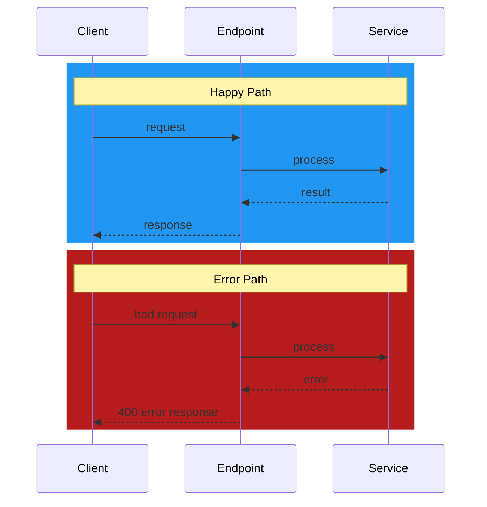
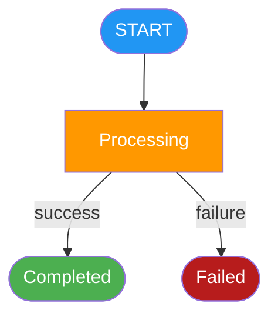

# Design Diagrams: [CHANGE-NAME]

**Change**: [CHANGE-NAME] | **Design**: [link to design.md]

## Color Conventions

Use only the colors whose flow types exist in this change. Do not invent
flow categories to justify using a color.

| Flow Type | Color | Hex |
|-----------|-------|-----|
| Submission / happy-path | blue | `#2196F3` |
| Validation / processing | amber | `#FF9800` |
| Safety / blocking / rejection | red | `#F44336` |
| Human-review / approval (HITL) | purple | `#9C27B0` |
| Routing / delivery / success | green | `#4CAF50` |
| Error / failure | crimson | `#B71C1C` |

## External / Out-of-Scope Systems

- Wrap external actors and systems in a subgraph labelled "External" or "Out of Scope"
- Style every external node with a dashed border:
    `style NodeId stroke-dasharray:5 5,stroke:#999,fill:#f5f5f5,color:#333`
- Use dotted arrows (`-.->`) for ALL connections to/from external nodes
- Do NOT use dotted arrows for internal indirect connections — use a comment instead

## Message Broker / Topic Nodes

When the design describes pub/sub, event sourcing, or topic-based communication:

- Represent every topic as an explicit named node — NEVER collapse topic into an arrow label
- Flowchart shape: cylinder -> `TOPIC_ID[(topic-name)]`
- Flowchart grouping: place in a subgraph labelled "Message Broker" or "Topics"
- Flowchart style: `fill:#FFF9C4,stroke:#F9A825,color:#333`
- Producer edge: solid arrow `-->` labelled "publish"
- Consumer edge: solid arrow `-->` labelled "subscribe"
- Sequence diagram: declare as participant, e.g. `participant T as topic-name`

## Sequence Numbers

Add numbered markers on flowchart edge labels to show execution order.
Use `linkStyle N stroke:#RRGGBB,stroke-width:2px` to color edges by flow.
`linkStyle` indices are 0-based and match the order edges are declared.

## Arrow Conventions — Component vs Domain Object

Distinguish between runtime component-to-component communication and
compile-time dependencies on domain objects:

| Relationship | Arrow | Label examples | When to use |
|---|---|---|---|
| Component-to-component (runtime call via `ComponentClient`, HTTP, gRPC) | Solid thick arrow `==>` | "invoke", "command", "query" | Endpoint→Entity, Endpoint→Agent, Agent→Entity, Workflow→Entity |
| Component-to-service-object (runtime call to an injected dependency) | Solid arrow `-->` | "loads", "get catalog" | Entity→Provider, Agent→Provider |
| Component/object uses domain object (compile-time, in-process) | Thin dotted arrow `-.->` with italic label | "_builds_", "_uses_", "_produces_" | Entity→DomainRecord, Agent→DomainRecord, Provider→DomainRecord |
| External system connection | Dotted arrow `-.->` | "request", "POST /path" | Client→Endpoint |

This prevents confusion between a `ComponentClient` call (crosses process
boundaries, involves serialization) and a plain Java method call or object
construction.

---

## 1. Component Dependencies

<!--
  Flowchart showing every component from design.md and how they connect.
  - One node per class/component (use short names)
  - Group by layer or package with subgraph blocks
  - Color edges by flow type (see Color Conventions)
  - Sequence numbers on connections show runtime call order
  - External / out-of-scope: dashed border node + dotted arrow
  - IMPORTANT: Use different arrow styles to distinguish:
    - ==> for component-to-component calls (ComponentClient, HTTP, gRPC)
    - --> for component-to-service-object calls (injected dependencies)
    - -.-> with italic label for compile-time domain object usage
-->

---

## 2. Sequence Diagram

<!--
  End-to-end sequence diagram showing the primary flows from design.md.
  - Use rect blocks to color each flow section
  - Match colors to Color Conventions
  - Include at least: happy path and one error path
  - Valid arrow types: ->> (solid), -->> (dotted async), -> (solid open), --> (dotted open)
  - Do NOT use -.>> — it is invalid in Mermaid sequence diagrams
-->

---

## 3. State Machines

<!--
  INCLUDE ONLY if the design describes stateful components (workflows, sagas,
  state machines, entities with lifecycle).
  Remove this section entirely if no stateful components exist.

  REPEAT the subsection below once per stateful component.

  Per diagram:
  - Show every state as a node
  - Color nodes by flow category:
      Entry / initial state   -> blue
      Processing states       -> amber
      HITL / review states    -> purple
      Terminal success        -> green
      Terminal failure        -> red/crimson
  - Label transitions with the trigger
-->

### 3.1 ComponentName

