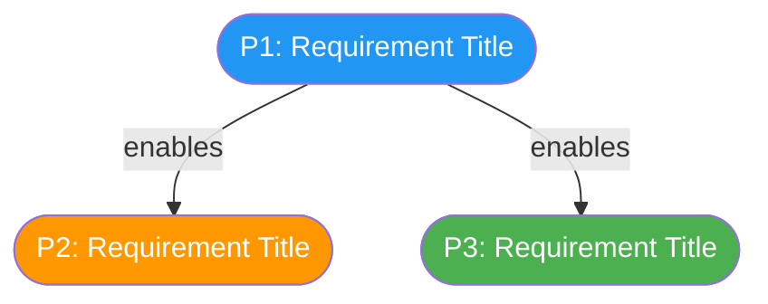
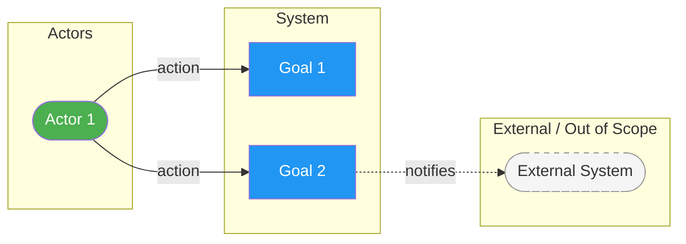
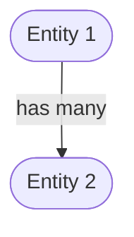
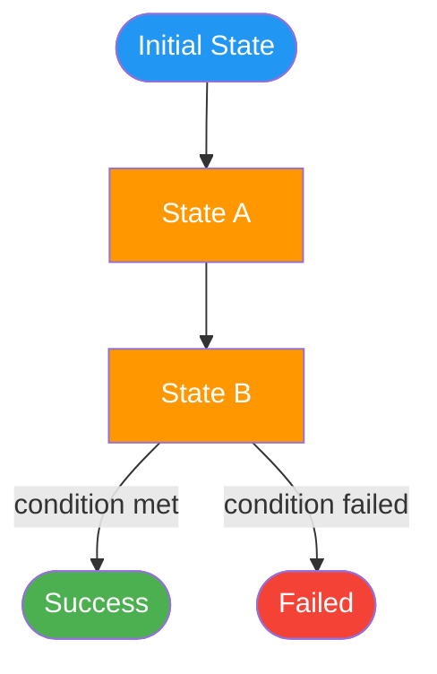

# Spec Diagrams: [CHANGE-NAME]

**Change**: [CHANGE-NAME] | **Specs**: [links to spec files]

## Color Conventions

Use only the colors whose categories exist in this change. Do not invent
categories to justify using a color.

| Category | Color | Hex |
|----------|-------|-----|
| Primary / P1 requirements | blue | `#2196F3` |
| Secondary / P2 requirements | amber | `#FF9800` |
| Tertiary / P3+ requirements | green | `#4CAF50` |
| Human actor | green | `#4CAF50` |
| External / out-of-scope system | grey dashed | `#f5f5f5` + `stroke-dasharray:5 5,stroke:#999` |
| Terminal / failure state | red | `#F44336` |
| Error / failure state | crimson | `#B71C1C` |
| Review / decision point | purple | `#9C27B0` |

## External / Out-of-Scope Systems

- Wrap external actors and systems in a subgraph labelled "External" or "Out of Scope"
- Style every external node with a dashed border:
    `style NodeId stroke-dasharray:5 5,stroke:#999,fill:#f5f5f5,color:#333`
- Use dotted arrows (`-.->`) for ALL connections to/from external nodes

---

## 1. User Journey Map

<!--
  Flowchart of user stories / requirements from specs, ordered by priority.
  Show dependencies between stories with "enables" edges.
  Color nodes by priority tier.
-->

---

## 2. Actor-Goal Overview

<!--
  Flowchart showing which actors interact with which system goals.
  Derive actors and goals from spec requirements and scenarios.
  External systems get dashed borders and dotted arrows.
-->

---

## 3. Entity Relationship Map

<!--
  INCLUDE ONLY if specs define key entities or domain objects.
  Omit this section entirely if no entities are described.
  Show conceptual relationships, not database schemas.
-->

---

## 4. Status Lifecycle

<!--
  INCLUDE ONLY if specs describe states, statuses, or lifecycle transitions.
  Omit this section entirely if no lifecycle is described.
  Show state progressions with triggers on the edges.
-->

