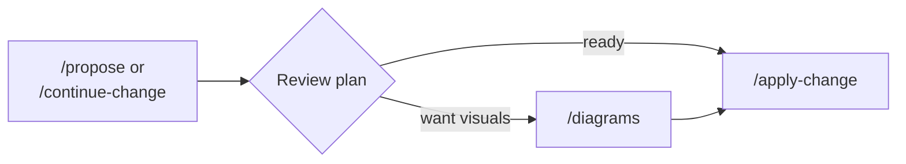

# openspec-diagrams

Mermaid diagram generation from OpenSpec change artifacts.

Reads your OpenSpec specs and design documents and generates visual diagrams:

- **From specs**: User journey maps, actor-goal overviews, entity relationships, status lifecycles
- **From design**: Component dependency graphs, sequence diagrams, state machines

## Installation

### Claude Code (plugin from GitHub)

```sh
# Register as a marketplace (project-scoped)
claude plugin marketplace add aklikic/openspec-diagrams-plugin --scope project

# Install the plugin
claude plugin install openspec-diagrams --scope project
```

Or load locally for a single session:
```sh
claude --plugin-dir /path/to/openspec-diagrams-plugin
```

### Copilot / agents (manual from git)

Clone and copy the skill files into your project:
```sh
git clone https://github.com/aklikic/openspec-diagrams-plugin.git
cp -r openspec-diagrams-plugin/skills/diagrams <your-project>/.agents/skills/diagrams
```

For GitHub Copilot specifically:
```sh
cp -r openspec-diagrams-plugin/skills/diagrams <your-project>/.github/copilot/skills/diagrams
```

### Manual copy (any tool)

If you already have the repo locally, copy to the appropriate skills directory:
```sh
# For agents / Copilot
cp -r skills/diagrams <your-project>/.agents/skills/diagrams

# For Claude Code
cp -r skills/diagrams <your-project>/.claude/skills/diagrams
```

## Usage

### When to use

Run after your planning artifacts (specs and/or design) exist for a change.
Typically after `/openspec-propose` completes, or after creating specs and
design via `/openspec-continue-change`.

Diagrams are supplementary — they do not block the apply phase and are not
tracked by OpenSpec status.

### Invoke the skill

```
/diagrams <change-name>
```

The `<change-name>` is the name of your OpenSpec change (e.g. `greeter-agent`,
`add-user-auth`). It is optional — if omitted, the skill will list active
changes and ask you to pick one.

The skill checks which artifacts exist and runs the applicable mode(s):

| Source artifact | Output file | Diagrams generated |
|---|---|---|
| `specs/**/*.md` | `spec-diagrams.md` | User journey map, actor-goal overview, entity relationships, status lifecycle |
| `design.md` | `design-diagrams.md` | Component dependencies, sequence diagram, state machines |

If both specs and design exist, both diagram files are generated.
If neither exists, the skill informs you and stops.

### Output

Diagram files are written to the change directory alongside the planning artifacts:

```
openspec/changes/<change-name>/
  proposal.md
  specs/
  design.md
  tasks.md
  spec-diagrams.md         <-- generated
  design-diagrams.md       <-- generated
```

Diagram sections are omitted if the source artifacts don't contain the
prerequisite content (e.g. no entity relationship diagram if specs don't
define entities, no state machines if design has no stateful components).
The skill never invents data to fill a diagram.

### Where it fits in the workflow



## Requirements

- OpenSpec CLI (`brew install openspec`)
- An active OpenSpec change with specs and/or design artifacts

## Structure

```
openspec-diagrams-plugin/
  .claude-plugin/              # Claude Code plugin manifests
    plugin.json
    marketplace.json
  .apm/skills/diagrams/        # apm-compatible distribution
  skills/diagrams/             # Source skill files
    SKILL.md                   # Skill definition
    spec-diagrams.template.md
    design-diagrams.template.md
  plugin.json                  # Plugin metadata
```

## License

MIT